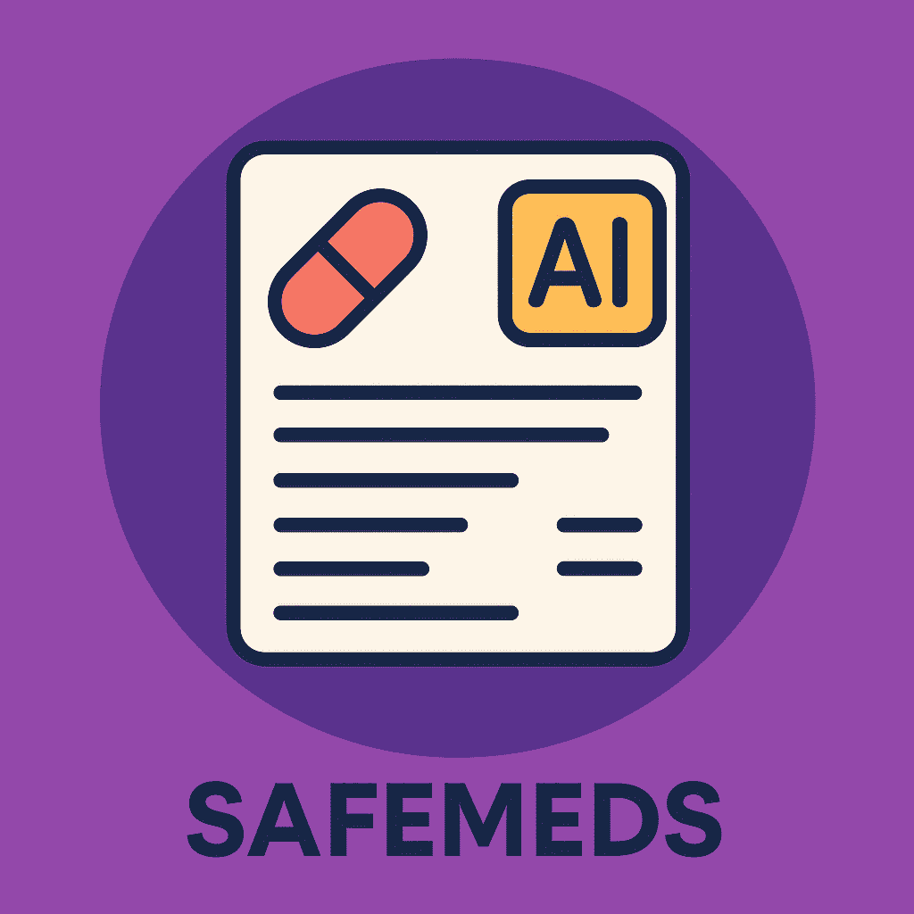

<div align="center">



<h1>SafeMeds 💊</h1>

<p><strong>SafeMeds</strong> is an open-source app that uses AI to help you better understand your medications.<br>
Just snap a photo of a prescription, and SafeMeds will extract all the medicines along with details like dosage, type, and duration.<br>
And than You can then ask questions about the medicines to learn their purpose, possible side effects, and necessary precautions.</p>
</div>

---

## 🌟 Features:
- 🖥️ **Intuitive Interface**: 
A user-friendly interface that simplifies the chat experience.
- 📸 **Image Recognition**:
Extracts text from images using the Gemini API.
- 📚 **Knowledge Base**:
Add documents to the Pinecone DB and get relevant answers.
- 💬 **Chatbot**:
Ask questions about medicines and get instant answers.
- 🔓 **Open Source**:
100% open source & free to use.

---

## 📱 Screenshots

| Upload | Add | Ask |
|--------|--------|--------|
|  |  |  |

> Optional — Add documents to the Knowledge Base for more relevant answers.

---

## 📦 Run

```sh
npm install
npm run dev
```

Create a .env file and add the following variables

```sh
GEMINI_API_KEY = your_gemini_api_key
PINECONE_API_KEY = your_pinecone_api_key
HF_TOKEN = your_huggingface_token
```
Get the keys from:

[Google Cloud Console](https://aistudio.google.com/apikey/) - to generate your Gemini API key <br>
[Pinecone API](https://www.pinecone.io/) - for Pinecone API key <br>
[Huggingface API](https://huggingface.co/) - for Huggingface API key

---

## ⭐️ Support
If you find SafeMeds useful, consider giving the repo a ⭐️ on GitHub!

---

## 👋 Connect

<div align="left">
    <p>
    <a href="https://github.com/MoazIrfan">
        
    </a>&nbsp;
    <a href="https://moazirfan.com/">
        
    </a>&nbsp;
     <a href="https://twitter.com/MoazIrfan/">
        
    </a>&nbsp;
    <a href="https://www.linkedin.com/in/moazirfan/">
        
    </a>&nbsp;
</p>
</div>
